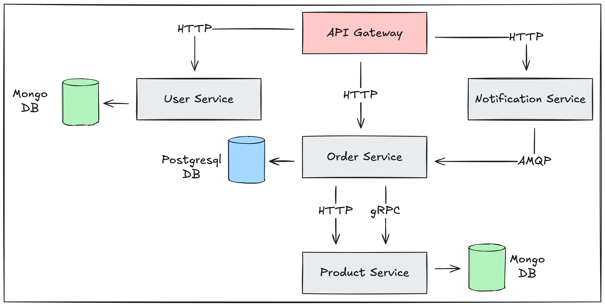

# E-Commerce Microservices Lab

Учебный проект микросервисной архитектуры на TypeScript + Express, предназначенный для исследования способов взаимодействия сервисов:
- HTTP
- gRPC
- RabbitMQ (event-driven)

Проект также используется для сравнения производительности взаимодействия микросервисов.

## Архитектура проекта

Система построена по микросервисной архитектуре, где каждый сервис отвечает за свою доменную область и имеет собственную базу данных.

### Основные компоненты

#### API Gateway

Это единая точка входа для клиентов. API Gateway взаимодействует с:
- User Service
- Order Service
- Notification Service

через HTTP.

#### User Service

Отвечает за управление пользователями. Использует MongoDB для хранения.

#### Product Service
Product Service управляет продуктами и предоставляет их по запросу Order Service **напрямую**. Использует MongoDB для хранения. Order Service может получать продукты двумя способами: HTTP и gRPC. Это сделано специально для **сравнения производительности различных способов взаимодействия** сервисов.

#### Order Service

Order Service отвечает за создание и хранения заказов.

#### Notification Service

Notification Service отвечает за публикацию событий.
Он получает HTTP запросы и отправляет события в RabbitMQ.