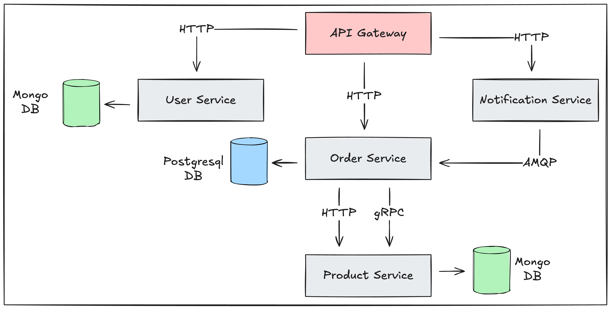

# E-Commerce Microservices Lab

Экспериментальный стенд для выпускной квалификационной работы, посвящённой сравнительному исследованию межсервисного взаимодействия в микросервисных веб-приложениях.

Репозиторий содержит две функционально эквивалентные реализации e-commerce приложения, общую инфраструктуру, сценарии нагрузочного тестирования и веб-ресурс для публикации методики и результатов эксперимента.

## Назначение проекта

Цель стенда - обеспечить воспроизводимую экспериментальную оценку производительности микросервисного приложения при одинаковой архитектуре, бизнес-логике, составе сервисов, сценариях нагрузки и инфраструктурных условиях.

В рамках стенда сравниваются:

- программно-технологические реализации: **Node.js + Express** и **Go + Fiber**;
- синхронное межсервисное взаимодействие через **HTTP** и **gRPC**;
- асинхронная публикация событий через **RabbitMQ / AMQP**;
- временные и ресурсные метрики работы микросервисной системы под нагрузкой.

## Архитектура



Система построена по микросервисной архитектуре. Внешние запросы проходят через API Gateway, а отдельные сервисы отвечают за самостоятельные доменные области и используют выделенные хранилища данных.

### Сервисы

| Сервис | Назначение | Хранилище / интеграции |
| --- | --- | --- |
| API Gateway | Единая точка входа для клиентских запросов, маршрутизация к доменным сервисам | HTTP |
| Users Service | Управление пользователями и получение пользовательских данных | MongoDB |
| Products Service | Управление товарами и предоставление данных для заказов | MongoDB, HTTP, gRPC |
| Orders Service | Создание заказов, чтение заказов, агрегация данных пользователей и товаров | PostgreSQL, HTTP, gRPC, RabbitMQ consumer |
| Notification Service | Приём запросов на обновление статуса заказа и публикация события | RabbitMQ / AMQP |

### Исследуемые сценарии

| Сценарий | Маршрут | Что измеряется |
| --- | --- | --- |
| `get-all-orders-http` | API Gateway -> Orders Service -> Products Service через HTTP | чтение и агрегация заказов при HTTP-взаимодействии |
| `get-all-orders-grpc` | API Gateway -> Orders Service -> Products Service через gRPC | влияние gRPC на тот же сценарий чтения |
| `create-order` | API Gateway -> Orders Service | операция записи и сохранения заказа |
| `update-order-status` | API Gateway -> Notification Service -> RabbitMQ -> Orders Service | асинхронное обновление статуса заказа через событие |

## Структура репозитория

```text
.
├── ecommerce-ts-express/     # реализация на Node.js, TypeScript и Express
├── ecommerce-go-fiber/       # реализация на Go и Fiber
├── infrastructure/           # MongoDB, PostgreSQL, RabbitMQ, Prometheus, cAdvisor и seed-данные
├── benchmark/                # k6-сценарии, раннеры и результаты нагрузочных тестов
├── site/                     # React/Vite веб-ресурс с методикой и результатами исследования
└── docs/                     # схемы и вспомогательные материалы
```

## Технологический стек

| Область | Технологии |
| --- | --- |
| TypeScript-реализация | Node.js, Express, TypeScript, npm workspaces |
| Go-реализация | Go, Fiber |
| Межсервисное взаимодействие | HTTP, gRPC, Protocol Buffers, RabbitMQ / AMQP |
| Хранилища | MongoDB, PostgreSQL |
| Инфраструктура | Docker, Docker Compose, Prometheus, cAdvisor |
| Нагрузочное тестирование | k6, `docker stats` |
| Веб-ресурс | React, Vite, TypeScript, Tailwind CSS, Chart.js |

## Быстрый запуск стенда

Требования:

- Docker и Docker Compose;
- Node.js и npm для seed-данных, benchmark и веб-ресурса;
- Go для локальной разработки Go-реализации;
- k6 для запуска нагрузочных сценариев.

### 1. Запустить инфраструктуру

```bash
docker compose -f infrastructure/docker-compose.yml --profile all up -d
```

Инфраструктура поднимает:

- MongoDB для пользователей: `localhost:27017`;
- MongoDB для товаров: `localhost:27018`;
- PostgreSQL для заказов: `localhost:5432`;
- RabbitMQ: `localhost:5672`, management UI: `http://localhost:15672`;
- Prometheus: `http://localhost:9090`;
- cAdvisor: `http://localhost:8080`.

### 2. Заполнить тестовые данные

```bash
cd infrastructure/seeds
npm install
npm run seed:users
npm run seed:products
npm run seed:orders
```

### 3. Запустить одну из реализаций

Node.js + Express:

```bash
cd ecommerce-ts-express
npm install
npm run build
docker compose up --build -d
```

Go + Fiber:

```bash
cd ecommerce-go-fiber
docker compose up --build -d
```

API Gateway будет доступен по адресам:

| Реализация | Gateway |
| --- | --- |
| Express | `http://localhost:3000` |
| Fiber | `http://localhost:4000` |

## Нагрузочное тестирование

Сценарии находятся в `benchmark/scenarios`, параметры нагрузки - в `benchmark/lib/config.js`, запуск - через `benchmark/scripts/run-*.sh`.

По умолчанию каждый сценарий использует постоянную нагрузку:

- `1000` виртуальных пользователей;
- длительность `1m`;
- задержка `1s` между последовательными запросами виртуального пользователя;
- thresholds: `http_req_failed < 5%`, `p95 < 2000ms`.

Примеры запуска:

```bash
cd benchmark
./scripts/run-get-all-orders-http.sh ts
./scripts/run-get-all-orders-grpc.sh go
```

Для сценариев записи нужны идентификаторы существующих сущностей:

```bash
USER_ID=<user-id> PRODUCT_ID=<product-id> ./scripts/run-create-order.sh ts
ORDER_ID=<order-id> STATUS=COMPLETED ./scripts/run-update-order-status.sh go
```

Поддерживаемые target:

- `ts` - Node.js + Express, gateway `http://localhost:3000`;
- `go` - Go + Fiber, gateway `http://localhost:4000`.

Результаты сохраняются в формате:

```text
benchmark/results/<scenario>/<target>/exp-XX/
├── run-01-summary.json
├── run-01-summary.html
├── run-01.log
├── run-01-docker-stats.csv
└── run-01-docker-stats-summary.json
```

## Метрики эксперимента

Для сопоставления реализаций используются:

- среднее время отклика;
- p95 времени отклика;
- пропускная способность, RPS;
- средняя и пиковая загрузка CPU;
- среднее и пиковое потребление оперативной памяти;
- доля ошибок HTTP-запросов.

Метрики времени и RPS берутся из k6, ресурсные метрики собираются через `docker stats` по контейнерам каждого стека и агрегируются в JSON-сводки.

## Результаты ВКР

Агрегированные результаты эксперимента показывают, что при одинаковой архитектуре и нагрузочных условиях реализация на Go + Fiber демонстрирует более высокую пропускную способность, меньшие значения среднего времени отклика и p95, а также существенно меньшее потребление оперативной памяти по сравнению с Node.js + Express.

При сравнении HTTP и gRPC эффект протокола оказался неоднозначным: в Fiber-разработке различия между HTTP и gRPC в сценариях чтения заказов минимальны, а в Express gRPC улучшает часть средних показателей, но сопровождается ростом потребления памяти и ухудшением p95. Поэтому выбор технологического стека оказывает более сильное влияние на итоговую производительность, чем замена HTTP на gRPC сама по себе.

## Веб-ресурс исследования

Каталог `site/` содержит интерактивный веб-ресурс для представления:

- цели и методики исследования;
- архитектуры экспериментального стенда;
- сценариев нагрузочного тестирования;
- таблиц и графиков с результатами;
- сведений об авторе.

Запуск локально:

```bash
cd site
npm install
npm run dev
```

Синхронизация данных benchmark в сайт:

```bash
cd site
npm run sync:benchmark-data
```

## Воспроизводимость

Стенд ориентирован на сопоставимое экспериментальное измерение, поэтому при повторении тестов важно сохранять одинаковыми:

- активную реализацию приложения: Express или Fiber;
- состав контейнеров и инфраструктуры;
- подготовленные seed-данные;
- параметры k6-нагрузки;
- количество повторов сценариев;
- аппаратную среду и фоновые процессы;
- порядок запуска и сбора ресурсных метрик.
